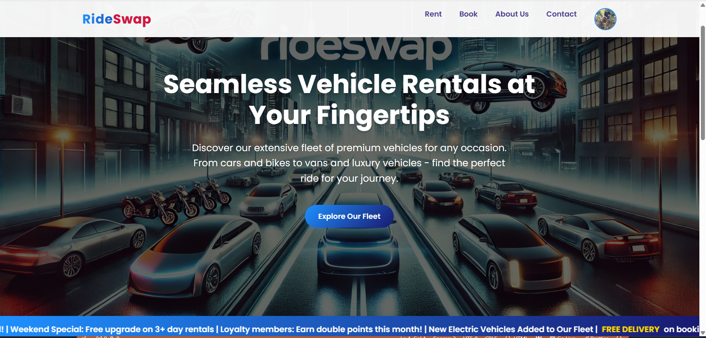

# RideSwap - Vehicle Rental Platform

## 🚗 Project Overview

RideSwap is a modern, responsive web-based vehicle rental platform that allows users to browse, book, and rent various types of vehicles including bikes, cars, autos, vans, and luxury vehicles. The platform provides a seamless user experience with features like user authentication, real-time booking, and comprehensive vehicle management.

## ✨ Features

### User Authentication
- *User Registration*: Complete signup with profile photo upload
- *Secure Login*: Email and password-based authentication
- *Session Management*: Automatic logout after 1 hour for security
- *Profile Management*: User profile display with dropdown menu

### Vehicle Booking System
- *Multiple Vehicle Categories*: Bikes, Cars, Autos, Vans, Luxury Cars
- *Real-time Pricing*: Dynamic price calculation based on rental duration
- *Date Validation*: Prevents past date selection and validates rental periods
- *GST Calculation*: Automatic 18% GST calculation on bookings
- *Booking Confirmation*: Detailed confirmation with unique booking ID

### Vehicle Management
- *Featured Vehicles*: Showcase of premium rental options
- *Vehicle Details*: Comprehensive information including fuel type, seating capacity
- *Category Filtering*: Easy browsing by vehicle type
- *Price Transparency*: Clear pricing structure per day/hour

### User Interface
- *Responsive Design*: Mobile-friendly across all devices
- *Modern UI/UX*: Clean, intuitive interface with smooth transitions
- *Interactive Elements*: Modal dialogs, form validations, and animations
- *Professional Layout*: Consistent branding and navigation

## 🛠 Technology Stack

- *Frontend*: HTML5, CSS3, JavaScript (ES6+)
- *Storage*: Browser LocalStorage and SessionStorage
- *Styling*: Custom CSS with responsive design
- *Forms*: Client-side validation and data handling
- *Images*: Optimized vehicle and profile images

## 📁 Project Structure

rideswap/
├── login.html              # Entry point & authentication
├── home.html               # Dashboard
├── about.html              # Company info
├── booking.html            # Vehicle selection
├── rent.html               # Featured vehicles
├── contact.html            # Contact form
├── login.css/js            # Authentication
├── home.css/js             # Dashboard logic
├── booking.css/js          # Booking system
├── rent.css/js             # Rental management
├── contact.css/js          # Contact handling
└── images/                 # Assets

## 🚀 Getting Started

### Prerequisites
- Modern web browser (Chrome, Firefox, Safari, Edge)
- No server setup required - runs entirely in browser

### Installation

1. *Clone the repository*
   bash
   git clone https://github.com/srikarmalla/rideswap.git
   cd rideswap
   

2. *Launch the application*
   bash
   # Option 1: Direct file opening
   open login.html  # Mac
   start login.html # Windows
   
   # Option 2: Using Python server
   python -m http.server 8000
   # Then visit http://localhost:8000/login.html
   
   # Option 3: Using Node.js server
   npx http-server
   

3. *Access the application*
   - Open login.html in your web browser
   - Create a new account or use existing credentials

## 📖 Usage Guide

### User Registration
1. Click "Register here" on the login page
2. Fill in required information:
   - Full Name
   - 10-digit Phone Number
   - Email Address
   - Password (6-8 characters)
   - Optional: Profile Photo
3. Complete registration and login

### Booking a Vehicle
1. *Browse Vehicles*: Navigate to "Rent" or "Book" sections
2. *Select Vehicle*: Choose from available categories
3. *Fill Booking Details*:
   - Pickup and Return dates
   - Personal information
   - ID verification (Passport, License, Aadhar, PAN)
4. *Confirm Booking*: Review details and confirm
5. *Get Confirmation*: Receive booking ID and printable confirmation

### Vehicle Categories & Pricing
- *Bikes*: ₹50/hour - ₹2,000/day
- *Mini-Auto*: ₹80/hour
- *Auto*: ₹100/hour
- *Cars*: ₹120/hour - ₹15,000/day
- *Vans*: ₹150/hour
- *Luxury Cars*: ₹300/hour - ₹97,500/day

## 🔧 Key Features Implementation

### Data Validation
- *Phone Numbers*: 10-digit validation
- *Email*: Format validation with real-time feedback
- *Dates*: Future date validation and range limits
- *Forms*: Comprehensive client-side validation

### Security Features
- *Password Encryption*: Secure password handling
- *Session Management*: Automatic timeout
- *Input Sanitization*: XSS prevention
- *Data Validation*: Server-side equivalent validation

### User Experience
- *Responsive Design*: Adapts to all screen sizes
- *Loading States*: Visual feedback during operations
- *Error Handling*: User-friendly error messages
- *Accessibility*: Keyboard navigation and screen reader support

## 👥 Team

- *Nikhil Reddy* - CEO & Founder
- *Srikar Malla* - Technical Director  
- *Vineet Kashyap* - Creative Director

## 📞 Contact Information

- *Email*: srikarmalla06@gmail.com
- *Phone*: +91 8328583198
- *Address*: Ettimadai, Coimbatore

## 🌟 Future Enhancements

- [ ] Backend API integration
- [ ] Payment gateway integration
- [ ] Real-time vehicle tracking
- [ ] Mobile app development
- [ ] Advanced search and filtering
- [ ] User reviews and ratings
- [ ] Loyalty program implementation
- [ ] Multi-language support

## 🐛 Known Issues

- Uses browser storage (data clears on browser reset)
- No real payment processing
- Limited to client-side validation
- No real-time vehicle availability

## 📄 License

© 2025 RideSwap. All Rights Reserved.

## 🤝 Contributing

1. Fork the repository
2. Create a feature branch (git checkout -b feature/AmazingFeature)
3. Commit changes (git commit -m 'Add AmazingFeature')
4. Push to branch (git push origin feature/AmazingFeature)
5. Open a Pull Request

---

*Made with ❤ by the RideSwap Team*
